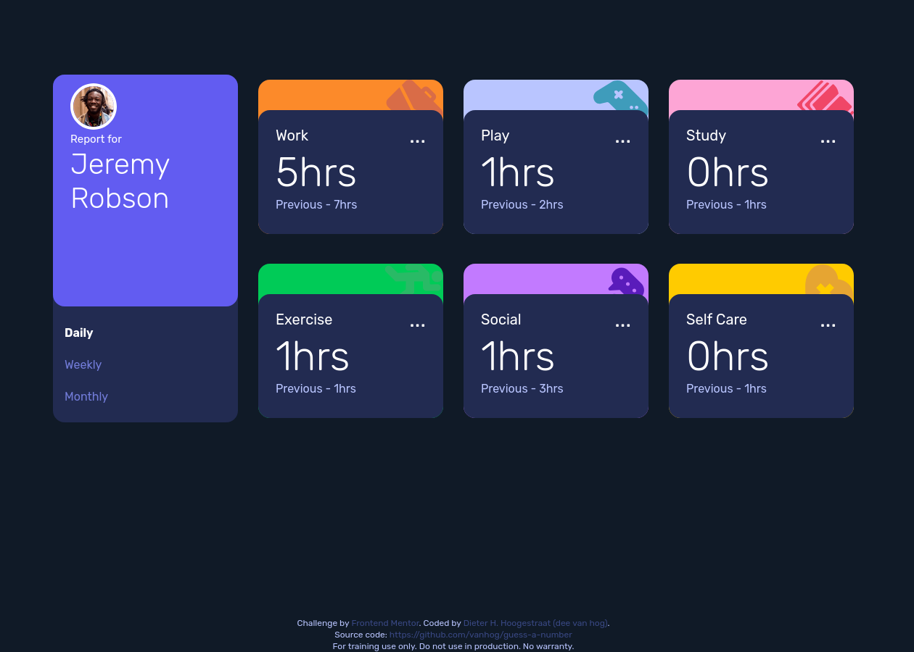

# Frontend Mentor - Time tracking dashboard solution

This is a solution to the [Time tracking dashboard challenge on Frontend Mentor](https://www.frontendmentor.io/challenges/time-tracking-dashboard-UIQ7167Jw). Frontend Mentor challenges help you improve your coding skills by building realistic projects. 

## Table of contents

- [Overview](#overview)
  - [The challenge](#the-challenge)
  - [Screenshot](#screenshot)
  - [Links](#links)
- [My process](#my-process)
  - [Built with](#built-with)
  - [What I learned](#what-i-learned)
  - [Continued development](#continued-development)
- [Author](#author)

## Overview

### The challenge

Users should be able to:

- View the optimal layout for the site depending on their device's screen size
- See hover states for all interactive elements on the page
- Switch between viewing Daily, Weekly, and Monthly stats

### Screenshot

### Links

- Solution URL: [https://github.com/vanhog/time-tracking-dashboard](https://github.com/vanhog/time-tracking-dashboard)
- Live Site URL: https://time-tracking-dashboard-cmpt.netlify.app/](https://time-tracking-dashboard-cmpt.netlify.app/)

## My process

### Built with

- Semantic HTML5 markup
- CSS custom properties
- Flexbox
- Mobile-first workflow
- [Tailwindcss](https:/tailwindcss.com/) - CSS utility framework

### What I learned

I learned how to "instruction-based" popolate the DOM. This took me quite some time because it was  necessary to combine design and program logic in one step, what did not work out quite well. For the next projects I'll separate the data and structure more clearly from the rendering

### Continued development

Refabric the rendering to separate it from the data and program logic.

## Author

- Website - [Dieter H. Hoogestraat (Dee)](https://www.hoogestraat.com)
- Frontend Mentor - [@vanhog](https://www.frontendmentor.io/profile/vanhog)